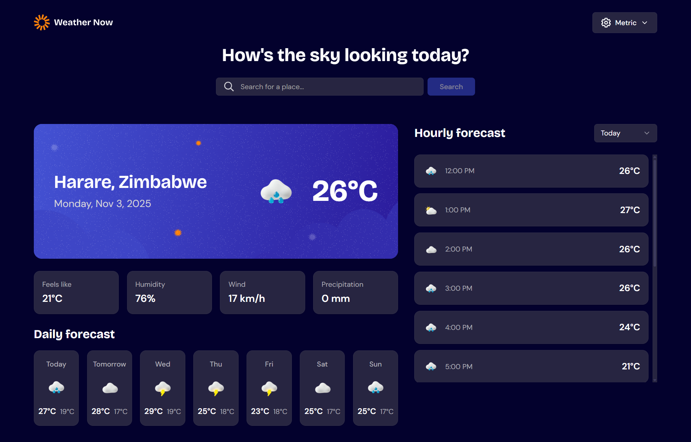

# Frontend Mentor - Weather app solution

This is a solution to the [Weather app challenge on Frontend Mentor](https://www.frontendmentor.io/challenges/weather-app-K1FhddVm49). Frontend Mentor challenges help you improve your coding skills by building realistic projects.

## Table of contents

- [Frontend Mentor - Weather app solution](#frontend-mentor---weather-app-solution)
  - [Table of contents](#table-of-contents)
  - [Overview](#overview)
    - [The challenge](#the-challenge)
    - [Screenshot](#screenshot)
    - [Links](#links)
  - [My process](#my-process)
    - [Built with](#built-with)
    - [What I learned](#what-i-learned)
    - [Continued development](#continued-development)
    - [Useful resources](#useful-resources)
  - [Author](#author)

## Overview

### The challenge

Users should be able to:

- Search for weather information by entering a location in the search bar
- View current weather conditions including temperature, weather icon, and location details
- See additional weather metrics like "feels like" temperature, humidity percentage, wind speed, and precipitation amounts
- Browse a 7-day weather forecast with daily high/low temperatures and weather icons
- View an hourly forecast showing temperature changes throughout the day
- Switch between different days of the week using the day selector in the hourly forecast section
- Toggle between Imperial and Metric measurement units via the units dropdown
- View the optimal layout for the interface depending on their device's screen size
- See hover and focus states for all interactive elements on the page

### Screenshot



### Links

- Solution URL: [View on Frontend Mentor](https://www.frontendmentor.io/solutions/a-responsive-weather-app-with-reactvite-vLOq7hSSco)
- Live Site URL: [View live site](https://weather-app-frontend-mentor-gamma.vercel.app/)

## My process

### Built with

- Semantic HTML5 markup
- CSS custom properties
- Flexbox
- CSS Grid
- Mobile-first workflow
- [React](https://reactjs.org/) - JS library
- [TypeScript](https://www.typescriptlang.org/) - For type safety
- [Vite](https://vitejs.dev/) - Build tool
- [Tailwind CSS](https://tailwindcss.com/) - For styles
- [shadcn/ui](https://ui.shadcn.com/) - Re-usable components built with Radix UI and Tailwind CSS
- [Radix UI](https://www.radix-ui.com/) - Accessible component primitives
- [React Context API](https://react.dev/reference/react/createContext) - State management
- [Open-Meteo API](https://open-meteo.com/) - Weather data and geocoding
- [Nominatim (OpenStreetMap)](https://nominatim.org/) - Reverse geocoding for accurate location data

### What I learned

This project was a great opportunity to deepen my understanding of React and modern web development practices:

**State Management with Context API:**
- Created a centralized `WeatherContext` to manage application state across components
- Implemented localStorage persistence for user preferences (unit selection)
- Learned to structure context providers to avoid unnecessary re-renders

```typescript
const setUnits = useCallback((newUnits: Units) => {
  setUnitsState(newUnits);
  localStorage.setItem(UNITS_STORAGE_KEY, newUnits);
  if (weatherData?.location) {
    loadWeatherData(weatherData.location, newUnits);
  }
}, [weatherData?.location, loadWeatherData]);
```

**Complex Data Manipulation:**
- Built sophisticated logic to group hourly forecast data by day and filter past hours
- Handled timezone conversions and date parsing across different formats
- Used `useMemo` for expensive computations to optimize performance

```typescript
const hourlyByDay = useMemo(() => {
  // Group hourly data by date and filter past hours
  const hourlyMap = new Map<string, typeof weatherData.hourly>();
  // ... complex grouping logic
}, [weatherData, currentTime]);
```

**Custom Hooks:**
- Created reusable hooks (`useWeather`, `useLocationSearch`) for better code organization
- Implemented debounced search functionality to reduce API calls

**TypeScript Best Practices:**
- Created comprehensive type definitions for weather data and API responses
- Used TypeScript's strict mode for better type safety
- Leveraged discriminated unions and utility types effectively

**Fast Refresh Compatibility:**
- Learned about React Fast Refresh requirements - files must export either components OR utilities, not both
- Separated `buttonVariants` into its own file to maintain Fast Refresh compatibility

**Working with shadcn/ui:**
- Used shadcn/ui components as a foundation for building accessible UI elements
- Learned how to customize shadcn components by copying them into the project and modifying them directly
- Discovered the importance of separating variant utilities from components to maintain Fast Refresh compatibility

**Geolocation and Reverse Geocoding:**
- Implemented browser geolocation API to automatically detect user location on app load
- Created a dual API strategy for reverse geocoding: primary Nominatim (OpenStreetMap) with Open-Meteo as fallback
- Solved the "Unknown" country issue by using Nominatim's more accurate reverse geocoding service
- Built distance calculation using Haversine formula to find nearest valid city when multiple results are returned
- Implemented proper error handling and fallbacks for geolocation permission denial or API failures

```typescript
// Dual API strategy for reliable reverse geocoding
const nominatimResult = await getLocationFromNominatim(latitude, longitude);
if (nominatimResult && nominatimResult.country !== 'Unknown') {
  return nominatimResult; // Use Nominatim if valid
}
// Fallback to Open-Meteo with distance-based filtering
```

### Continued development

For future projects, I'd like to focus on:

- **Testing**: Adding comprehensive unit tests for utility functions and hooks, plus integration tests for components using React Testing Library
- **Performance Optimization**: Implementing React.memo for components, virtual scrolling for long lists, and API response caching
- **Accessibility**: Enhancing keyboard navigation, improving ARIA labels, and ensuring full WCAG compliance
- **Error Handling**: Adding retry mechanisms with exponential backoff and better offline detection
- **Code Architecture**: Centralizing unit conversion logic and creating more reusable custom hooks

### Useful resources

- [React Documentation](https://react.dev/) - Comprehensive React documentation with modern patterns
- [TypeScript Handbook](https://www.typescriptlang.org/docs/handbook/intro.html) - Deep dive into TypeScript features
- [Tailwind CSS Documentation](https://tailwindcss.com/docs) - Utility-first CSS framework guide
- [shadcn/ui Documentation](https://ui.shadcn.com/) - Component library documentation and examples
- [Radix UI Documentation](https://www.radix-ui.com/primitives/docs/overview/introduction) - Accessible component primitives
- [Open-Meteo API Docs](https://open-meteo.com/en/docs) - Weather API documentation
- [Nominatim Documentation](https://nominatim.org/release-docs/develop/api/Reverse/) - Reverse geocoding API documentation
- [React Fast Refresh](https://github.com/facebook/react/issues/16604) - Understanding Fast Refresh requirements

## Author

- GitHub - [@keith-ufumeli](https://github.com/keith-ufumeli)
- Frontend Mentor - [@keith-ufumeli](https://www.frontendmentor.io/profile/keith-ufumeli)
